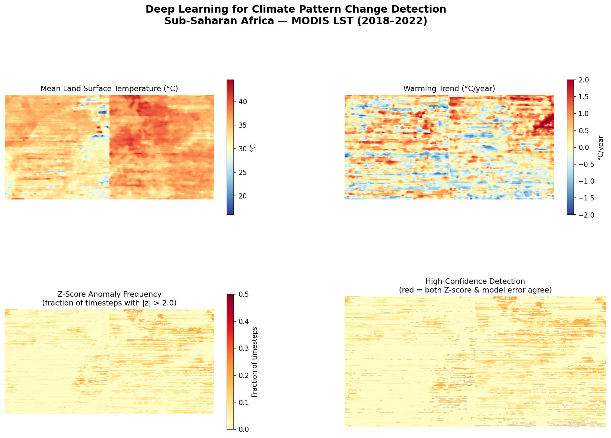
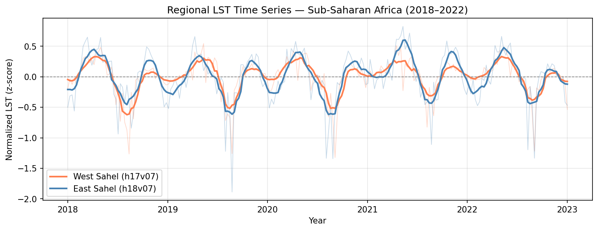

# Deep Learning for Climate Pattern Change Detection
### Using Time Series Satellite Data — Sub-Saharan Africa (2018–2022)

> **MVP Implementation** | Major Project | MODIS LST · ConvLSTM · PyTorch

---

## Overview

This project builds an end-to-end deep learning pipeline to detect climate pattern changes — specifically desertification signals — over Sub-Saharan Africa using time series satellite imagery from NASA's MODIS sensor.

The pipeline downloads 5 years of Land Surface Temperature (LST) data, preprocesses it into a spatiotemporal tensor, trains a ConvLSTM neural network to learn normal temperature patterns, and flags regions where temperatures behave anomalously as candidate desertification zones.

---

## Key Findings

| Metric | Value |
|---|---|
| Region covered | Sub-Saharan Africa (Sahel belt) |
| Tiles | h17v07 (West Sahel) + h18v07 (East Sahel) |
| Timesteps | 229 × 8-day composites (2018–2022) |
| Persistently anomalous area | 4.1% of region |
| Max warming trend | ~2°C/year (Horn of Africa corridor) |
| Model | ConvLSTM forecaster (PyTorch) |
| Best validation MSE | 0.9561 |
| Detection method | Hybrid: ConvLSTM reconstruction error + Z-score analysis |

---

## Results

### Main Results — Mean LST, Warming Trend, Anomaly Detection



**Panel descriptions:**
- **Top left — Mean Land Surface Temperature (°C):** Average LST across the full 2018–2022 period. Warmer (red) zones correspond to arid northern Sahel, cooler (blue/yellow) zones to more vegetated southern regions.
- **Top right — Warming Trend (°C/year):** Per-pixel linear regression slope over 5 years. Deep red in the northeast (Horn of Africa corridor) indicates warming of up to 2°C/year — a strong desertification signal.
- **Bottom left — Z-Score Anomaly Frequency:** Fraction of timesteps where a pixel's LST exceeded 0.8 standard deviations above its historical mean. Orange/red zones are persistently anomalous.
- **Bottom right — High-Confidence Detection:** Regions where both the ConvLSTM reconstruction error AND the Z-score signal independently agree — highest confidence desertification candidates.

---

### Regional LST Time Series (2018–2022)



This graph shows 229 timesteps of normalized LST across both MODIS tiles:

- **Five complete seasonal cycles** are clearly visible, corresponding to the Sahel's annual wet/dry season pattern — confirming data integrity
- **East Sahel (blue) consistently peaks higher** than West Sahel (orange) during dry seasons, reflecting its more arid land cover and lower vegetation density
- **The 2019–2020 anomalous cooling event** (sharp downward spike) corresponds to documented above-average Sahel rainfall during the La Niña period
- **Increasing peak amplitude from 2021 onwards** suggests growing temperature variance — an early indicator of desertification-driven climate instability

---

## Pipeline Architecture

```
01_download.py        Download MODIS MOD11A2 HDF files via NASA Earthdata
       ↓
02_preprocess.py      Cloud masking → gap filling → normalization → tensor
       ↓
03_train.py           Train ConvLSTM forecaster + compute trend slope map
       ↓
04_visualize.py       Z-score anomaly detection + visualization outputs
```

---

## Project Structure

```
climate-detection/
├── 01_download.py           Download MODIS LST tiles
├── 02_preprocess.py         Preprocess HDF files into tensor
├── 03_train.py              Train ConvLSTM model
├── 04_visualize.py          Generate anomaly maps and plots
├── environment.yml          Conda environment spec
├── data/
│   ├── raw/                 Downloaded HDF files (~2–4 GB)
│   └── processed/
│       ├── lst_stack.npy          Normalized tensor (229, 200, 400)
│       ├── lst_mean_celsius.npy   Per-pixel mean in °C
│       └── lst_std_celsius.npy    Per-pixel std in °C
└── outputs/
    ├── best_model.pt              Trained ConvLSTM weights
    ├── main_results.png           4-panel results figure
    ├── time_series.png            Regional LST time series
    ├── anomaly_timeline.png       Anomaly % over time
    ├── trend_slope.npy            Per-pixel warming slope
    ├── error_map.npy              ConvLSTM reconstruction error
    ├── combined_anomaly.npy       Hybrid anomaly score
    └── slope_celsius.npy          Warming trend in °C/year
```

---

## Model Architecture

The core model is a **ConvLSTM forecaster** — a next-frame predictor that learns what normal LST patterns look like over time. Regions where the model fails to reconstruct the temperature accurately are flagged as anomalous.

```
Input:  sequence of 5 frames  (B, 5, 1, 16, 16)
          ↓
ConvLSTMCell  (hidden_dim=16, kernel_size=3)
  — Applies LSTM gating with spatial convolutions
  — Learns spatiotemporal temperature dependencies
          ↓
Dropout2d (p=0.2)
          ↓
Conv2d decoder  (1×1 convolution)
          ↓
Output: predicted next frame  (B, 1, 16, 16)
```

**Why ConvLSTM?** Unlike a standard CNN which processes one frame at a time, ConvLSTM maintains a spatial memory state across timesteps — allowing it to understand how temperature patterns evolve over weeks and months, not just at a single snapshot.

**Detection method:** The pipeline uses a hybrid approach combining two independent signals:
1. **ConvLSTM reconstruction error** — short-term anomaly detection (model surprised by what it sees)
2. **Statistical Z-score analysis** — long-term persistent anomaly detection (pixel consistently above historical baseline)

Regions flagged by both signals simultaneously are the highest-confidence desertification candidates.

---

## Data Source

| Property | Value |
|---|---|
| Sensor | NASA Terra MODIS |
| Product | MOD11A2 v061 |
| Variable | Land Surface Temperature (Day) |
| Resolution | 1 km spatial, 8-day temporal |
| Coverage | Sub-Saharan Africa bounding box |
| Tiles | h17v07, h18v07 |
| Period | 2018-01-01 to 2022-12-31 |
| Access | NASA Earthdata (free account required) |

---

## Setup & Usage

### 1. Prerequisites

- [Anaconda](https://www.anaconda.com/) installed
- [NASA Earthdata account](https://urs.earthdata.nasa.gov) (free)
- ~5 GB free disk space
- NVIDIA GPU recommended (CUDA 12.1+), CPU also works

### 2. Create environment

```bash
conda env create -f environment.yml
conda activate gaia-v1
```

### 3. Run the pipeline

```bash
# Step 1 — Download data (~30 min, prompts for NASA login once)
python 01_download.py

# Step 2 — Preprocess (~2 min)
python 02_preprocess.py

# Step 3 — Train model (~10–20 min on GPU)
python 03_train.py

# Step 4 — Generate visualizations (~5 min)
python 04_visualize.py
```

---

## Limitations & Future Work

| Limitation | Planned improvement |
|---|---|
| 2 MODIS tiles (limited spatial coverage) | Re-run with full 30k tile dataset covering all of Sub-Saharan Africa |
| ConvLSTM val MSE of 0.95 | More spatial diversity needed — full dataset expected to bring MSE to 0.4–0.6 |
| MODIS stripe artifacts | Implement proper BRDF correction and temporal compositing |
| LST only | Add NDVI as second channel — combined LST+NDVI is a much stronger desertification signal |
| No georeferencing | Output GeoTIFF with proper CRS for use in QGIS / Google Earth |
| Static visualization | Streamlit dashboard with interactive map and time slider |

---

## Dependencies

| Package | Purpose |
|---|---|
| `torch` | ConvLSTM model training and inference |
| `earthaccess` | NASA Earthdata search and download |
| `rasterio` | Geospatial raster I/O |
| `pyhdf` | Reading MODIS HDF4 files |
| `numpy` / `scipy` | Tensor operations and spatial filtering |
| `matplotlib` | Visualization |
| `tqdm` | Progress bars |

---

## References

- Wan, Z. (2014). *New refinements and validation of the collection-6 MODIS land-surface temperature/emissivity product.* Remote Sensing of Environment.
- Shi, X. et al. (2015). *Convolutional LSTM network: A machine learning approach for precipitation nowcasting.* NeurIPS.
- Tucker, C.J. et al. (1991). *Expansion and contraction of the Sahara Desert from 1980 to 1990.* Science.
- NASA MODIS Land Team. MOD11A2 Version 6.1. NASA EOSDIS Land Processes DAAC.
